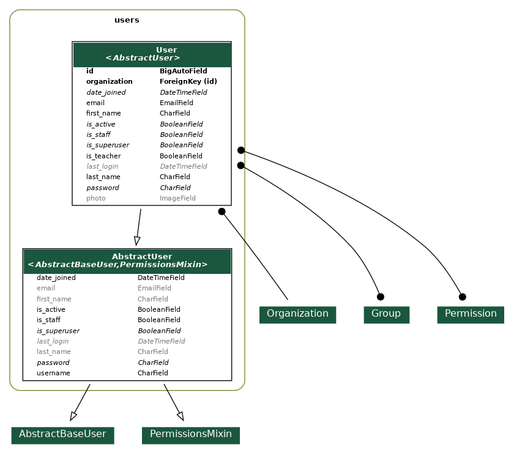
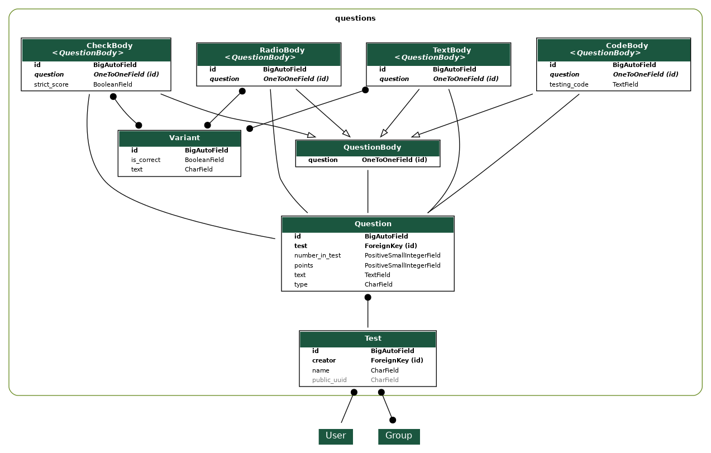
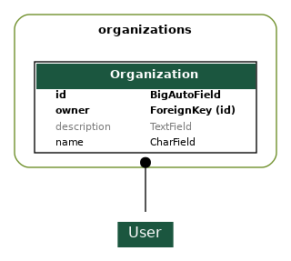
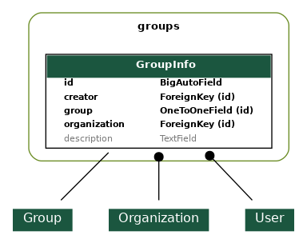
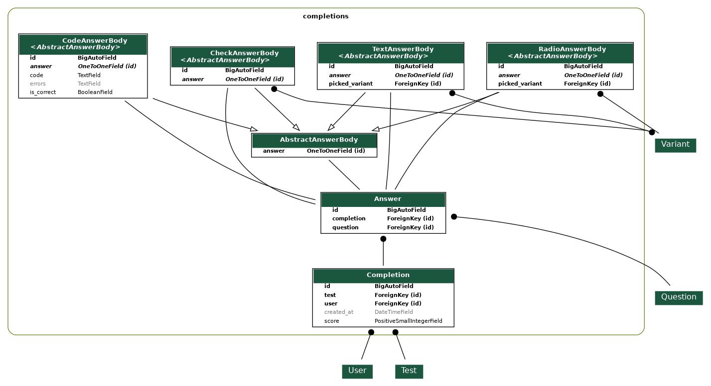
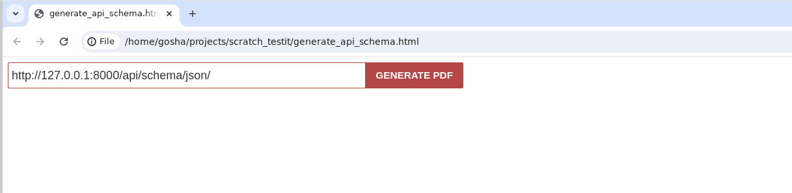

# TestIt | Документация для backend разработчика

## Обзор
Backend построен с помощью фреймворка DjangoRestFramework и дополнений к нему. С полным списком зависимостей можно ознакомится в файле `requirements.py`

### Перед началом работы следует ознакомится с основными библиотеками:
1. [Документация Django](https://docs.djangoproject.com/en/5.0/)
2. [Документация DRF](https://www.django-rest-framework.org/)

## Настройка среды разработки
На вашем компьютере должен быть установлен python версии > 3.10 (для поддержки аннотаций типов).
#### Команды для настройки:
```bash
python3 -m venv venv
source ./venv/bin/activate
pip install -r requirements.txt
python manage.py runserver
```
После выполнения этих четырех команд, запуститься локальный веб сервер с вашим проектом.

## Структура
Проект разбит на несколько приложений (django app). Каждое приложение находится в отдельной папке. Название приложения = название его папки.
**Каждое приложение отвечает за соответствующий роут `/{name}/*` где {name} - название приложения.**
Создать новое приложение можно командой `python manage.py startapp <name>`.
#### У каждого приложения есть:
- Модели - представления объектов, с которыми работает приложение в бд
- Сериализаторы (Serializers) - инструмент, переводящий объект из формата json в формат python и обратно
- Представления (Views) - обрабатывают информацию, приходящую на сервер и возвращают ответ. Обычно используют сериализаторы.
- Разрешения (Permissions) - нужны для настройки доступа к views.

**В данной документации описаны разрешения и модели для каждого приложения. Вы можете сами посмотреть код нужного сериализатора или представления, если потребуется.**
**Кроме того, вы можете подробно ознакомится с полями моделей и отношениями между ними с помощью приложенных схем: [db_schemas](./db_schemas/)**

### Users
#### Предоставляемые функции
- Регистрация нового пользователя
- Авторизация пользователя
- Изменение профиля текущего пользователя
- Просмотр всех прохождений **конкретного пользователя**

#### Модели БД

- User - основная модель пользователя

#### Разрешения
- IsTeacher - разрешает доступ только учителям.
- IsInSameOrganization - разрешает доступ, если пользователь и объект относятся к одной организации

### Questions
**Внимание!**
*Это приложение отвечает за **все тесты**, а не только за их вопросы.*
*Такой нейминг был выбран, поскольку название папки `tests` ассоциируется с тестами для проекта.*
#### Предоставляемые функции
- Создание тестов
- Просмотр тестов
- Настройка разрешений для прохождения
- Перегенерации ссылки для прохождения
- Просмотр всех прохождений **конкретного теста**

#### Модели БД

- Test - тест, содержащий вопросы.
- Question - один из вопросов теста. **Каждый вопрос может относится только к одному тесту.** У каждого вопроса есть тело - Body (одно из четырех типов). У каждого вопроса может быть только одно тело.
- \*\*\*\*Body - "тело" вопроса. Бывают четырех типов: TextBody, CheckBody, RadioBody, CodeBody. Абстрактный класс - QuestionBody.
- Variant - вариант ответа на вопрос. Используется в TextBody, RadioBody, CheckBody

#### Разрешения
- CanPassTest - проверяет, может ли пользователь проходить тест
- IsTestCreator - проверяет, является ли пользователь создателем теста

### Organizations
#### Предоставляемые функции
- Создание организации
- Просмотр всех существующих организаций
#### Модели БД

- Organization - организация
#### Разрешения
- HasNoOrg - проверяет, что пользователь не находится в организации
- HasOrg - проверяет, что пользователь находится в организации

### Groups
#### Предоставляемые функции
- Создание групп
- Удаление групп
- Просмотр групп
- Добавление/удаление участника группы
#### Модели БД

- Group - неизменяемая модель django, из модуля auth.
- GroupInfo - т.к. Group - неизменяемая, было принято решение сделать модель, содержащую доп. поля, которые нельзя включить в основную.
#### Разрешения
нет

### Completions
#### Предоставляемые функции
- Добавление нового прохождения (когда студент проходит тест)
- Просмотр прохождений
#### Модели БД

- Completion - прохождение теста. Содержит общую информацию о прохождении (пользователь, набранные баллы)
- Answer - ответ на конкретный вопрос теста
- \*\*\*\*AnswerBody - тело ответа. Бывают четырех видов - TextAnswerBody, RadioAnswerBody, CheckAnswerBody, CodeAnswerBody**Тип тела ответа совпадает с типом тела вопроса.**
#### Разрешения
нет

### Подсчет очков
*Сумма очков за прохождение (**completion.score**) = сумма очков за каждый ответ (**answer.get_points()**)*

Подсчет очков проиходит один раз, сразу после добавления прохождения в бд. Для подсчета очков у орм модели Answer есть метод **get_points()**, который считает и возвращает очки за этот ответ.

За каждый вопрос можно получить максимум **question.points** очков. (это задает клиент при создании теста)
В таблице будем считать, что **question.points**=1

#### Как считаются очки
Тип вопроса | 0 баллов | 1 балл | другое
--- | --- | --- | ---
code | Код выполнен с ошибкой | Код выполнен без ошибок
check (strict=True) | Выбраны не все правильные варианты / выбраны лишние варианты | Все варианты выбраны правильно
check (strict=False)
text | Введеное значение не совпадает ни с одним из ответов | Введеное значение совпадает с одним из ответов (сравнение не учитывает большие/маленькие буквы)
radio | Выбран неправильный ответ | Выбран правильный ответ


## Обновление схем бд
Для создания схем бд используется библиотека django-extensions и ее модуль Graph models. [Документация graph models](https://django-extensions.readthedocs.io/en/latest/graph_models.html).

### Быстрое создание схем
Для быстрого обновления схемы бд написан bash-скрипт.
Запуск:
```bash
source ./venv/bin/activate
bash generate_db_schema.sh
```
Результат работы скрипта - папка db_schemas с файлами .png.
Каждый файл - структура моделей для отдельного приложения.

## Обновление схем API
Для создания схем используется [RapiPdf](https://mrin9.github.io/RapiPdf/).

### Быстрое создание схем
Откройте файл [generate_api_schema.html](../generate_api_schema.html) в браузере.
Вы увидите такую страницу:

Нажмите **GENERATE PDF**.
**ВНИМАНИЕ! ПРИ ГЕНЕРАЦИИ ОБЯЗАТЕЛЬНО ДОЛЖЕН БЫТЬ ЗАПУЩЕН САМ ВЕБ-СЕРВЕР БЭКЕНДА**
